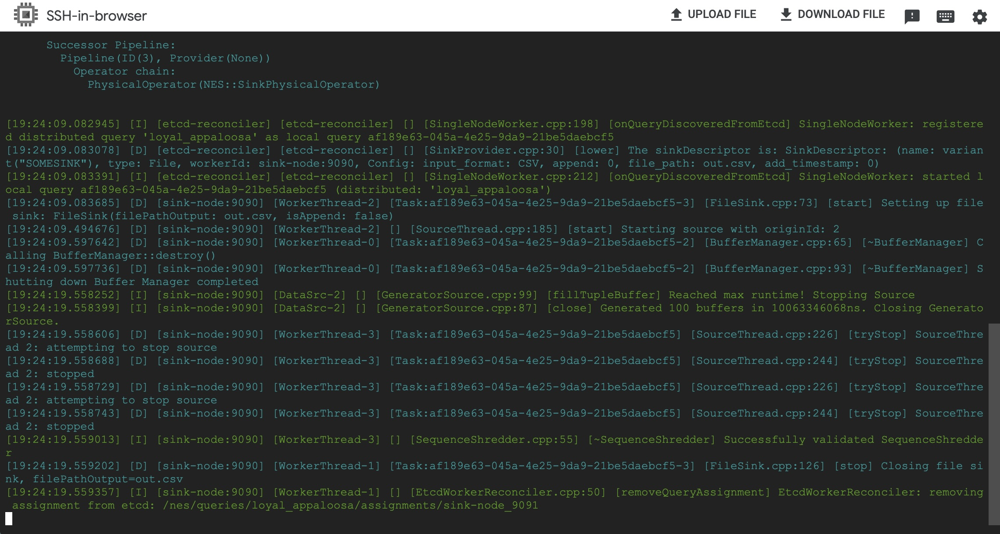
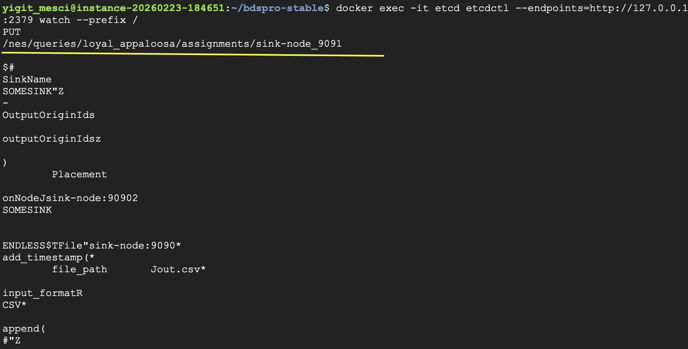
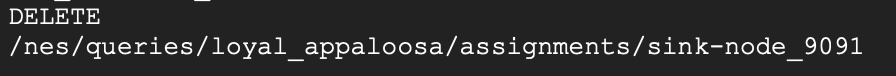
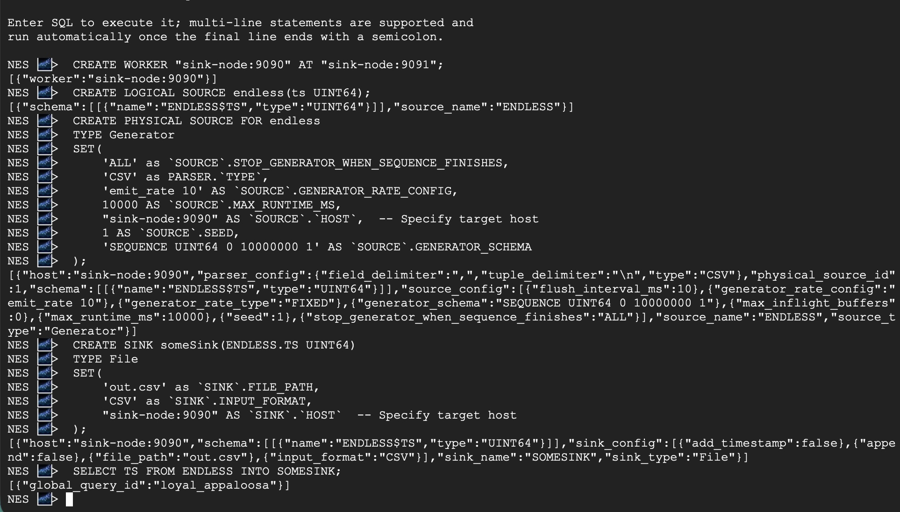

# ETCD Extension for Nebulastream – Distributed PoC

This document describes how to build and run the ETCD extension for Nebulastream's distributed proof-of-concept.

---

## Requirements

- Docker
- gcc
- libstdc++
- Working directory: `bdspro-stable/`

---

## Build Instructions

### 1. Install Docker Environment

```bash
./scripts/install-local-docker-environment.sh
```

### 2. Configure with CMake

```bash
docker run --workdir $(pwd) -v $(pwd):$(pwd) nebulastream/nes-development:local \
cmake -B cmake-build-debug -S .
```

### 3. Build

```bash
docker run --workdir $(pwd) -v $(pwd):$(pwd) nebulastream/nes-development:local \
cmake --build cmake-build-debug -j
```

---

## Start ETCD and Workers

```bash
docker compose -f etcd-workers.yaml up -d
```

---

## Watch ETCD Operations

To monitor all ETCD key changes:

```bash
docker exec -it etcd etcdctl \
--endpoints=http://127.0.0.1:2379 watch --prefix /
```

---

## Run Worker

Open a new terminal:

```bash
docker compose -f etcd-workers.yaml exec nes bash
cd ./cmake-build-debug/nes-single-node-worker

./nes-single-node-worker \
  --connection=sink-node:9090 \
  --grpc=sink-node:9091 \
  --enableEtcdReconciler=true \
  --etcdEndpoints=http://etcd:2379
```

The `--enableEtcdReconciler=true` flag enables:

- Query submission via ETCD
- Reconciliation after worker crashes
- Automatic key cleanup after completion

---

## Run NES REPL (Embedded Mode)

Open another terminal:

```bash
docker compose -f etcd-workers.yaml exec nes bash
cd ./cmake-build-debug/nes-nebuli/apps
./nes-repl-embedded -d -f JSON
```

---

## Submit a Short Query

Inside `nes-repl-embedded`:

```sql
-- 1. Register worker
CREATE WORKER "sink-node:9090" AT "sink-node:9091";

-- 2. Create logical source
CREATE LOGICAL SOURCE endless(ts UINT64);

-- 3. Create physical source
CREATE PHYSICAL SOURCE FOR endless
TYPE Generator
SET(
    'ALL' as `SOURCE`.STOP_GENERATOR_WHEN_SEQUENCE_FINISHES,
    'CSV' as PARSER.`TYPE`,
    'emit_rate 10' AS `SOURCE`.GENERATOR_RATE_CONFIG,
    10000 AS `SOURCE`.MAX_RUNTIME_MS,
    "sink-node:9090" AS `SOURCE`.`HOST`,
    1 AS `SOURCE`.SEED,
    'SEQUENCE UINT64 0 10000000 1' AS `SOURCE`.GENERATOR_SCHEMA
);

-- 4. Create sink
CREATE SINK someSink(ENDLESS.TS UINT64)
TYPE File
SET(
    'out.csv' as `SINK`.FILE_PATH,
    'CSV' as `SINK`.INPUT_FORMAT,
    "sink-node:9090" AS `SINK`.`HOST`
);

-- 5. Deploy query
SELECT TS FROM ENDLESS INTO SOMESINK;
```

---

## Expected Behaviour

1. Query is written to ETCD (PUT event).
2. Worker detects the new key.
3. Worker executes the query.
4. After completion, the worker deletes the key (DELETE event).
5. If the worker crashes during execution, it reconciles the query from ETCD upon restart.

---

## Screenshots

### Worker Processing



### ETCD PUT Event



### ETCD DELETE Event



### NES REPL


